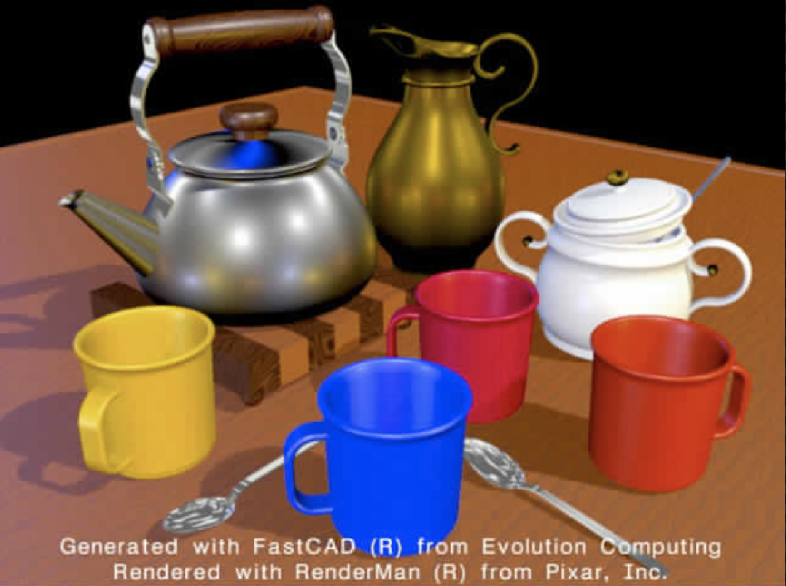
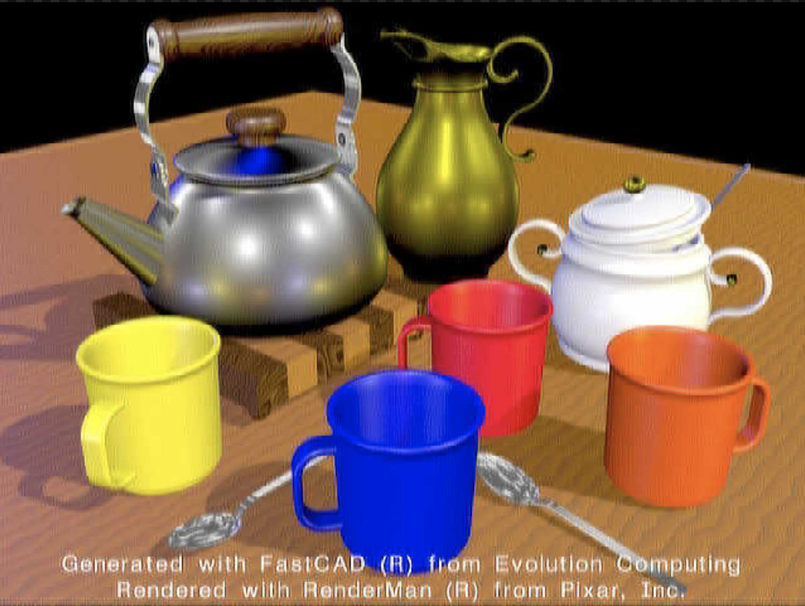

# JPEG: c-implementation

A C-based jpeg baseline encoder & decoder

## Prerequirements

- use [bitmap library](https://github.com/ArashPartow/bitmap) to access bmp file.
  - this library is written in c++, so we should compile whole project using `g++`

## How to use

### Compile

- use `makefile` to compile all

```sh
$ make
```

- and you can specific decoder or encoder, even clean (delete)
```sh
$ make encoder # g++ -o encoder encoder.c -O3
$ make decoder # g++ -o decoder decoder.c -O3
$ make clean # rm decoder encoder
```

- or compile with `g++`
```sh
$ g++ -o decoder decoder.c -O3
$ g++ -o encoder encoder.c -O3
```

### command example

- encoder: NOTICE that `input file` should be bmp, `output file` should be jpg
    - `output file` is optional, if you don't specify it, it would be `image.jpg`

```sh
$ ./encoder <input file> [output file]
```

- decoder: NOTICE that `input file` should be jpg, `output file` should be bmp
    - `output file` is optional, if you don't specify it, it would be `image.bmp`

```sh
$ ./decoder <input file> [output file]
```

- NOTICE that `$` stands for command prompt.

## environments

- already tested on my macOS and NTU CSIE server (Arch Linux), so any FreeBSD or Linux  environments should be fine.
- more detail below:
```sh
$ g++ -v
Configured with: --prefix=/Applications/Xcode.app/Contents/Developer/usr --with-gxx-include-dir=/Applications/Xcode.app/Contents/Developer/Platforms/MacOSX.platform/Developer/SDKs/MacOSX10.14.sdk/usr/include/c++/4.2.1
Apple LLVM version 10.0.1 (clang-1001.0.46.4)
Target: x86_64-apple-darwin18.5.0
```

```sh
r07922009@linux9 [~/JPEG] g++ -v
使用內建 specs。
COLLECT_GCC=g++
COLLECT_LTO_WRAPPER=/usr/lib/gcc/x86_64-pc-linux-gnu/8.3.0/lto-wrapper
目的：x86_64-pc-linux-gnu
配置為：/build/gcc/src/gcc/configure --prefix=/usr --libdir=/usr/lib --libexecdir=/usr/lib --mandir=/usr/share/man --infodir=/usr/share/info --with-bugurl=https://bugs.archlinux.org/ --enable-languages=c,c++,ada,fortran,go,lto,objc,obj-c++ --enable-shared --enable-threads=posix --enable-libmpx --with-system-zlib --with-isl --enable-__cxa_atexit --disable-libunwind-exceptions --enable-clocale=gnu --disable-libstdcxx-pch --disable-libssp --enable-gnu-unique-object --enable-linker-build-id --enable-lto --enable-plugin --enable-install-libiberty --with-linker-hash-style=gnu --enable-gnu-indirect-function --enable-multilib --disable-werror --enable-checking=release --enable-default-pie --enable-default-ssp --enable-cet=auto
執行緒模型：posix
gcc version 8.3.0 (GCC)
```

## Result

嘗試過許多種寫法後，發現都有一些瑕疵：偏暗以及模糊 (可參考如下)，最後我選擇繳交較為模糊但是顏色沒有偏掉者

可以參考我 github 的不同分支，可以看到不同的結果




## Author&LICENSE

MIT @kuoteng, 2019
